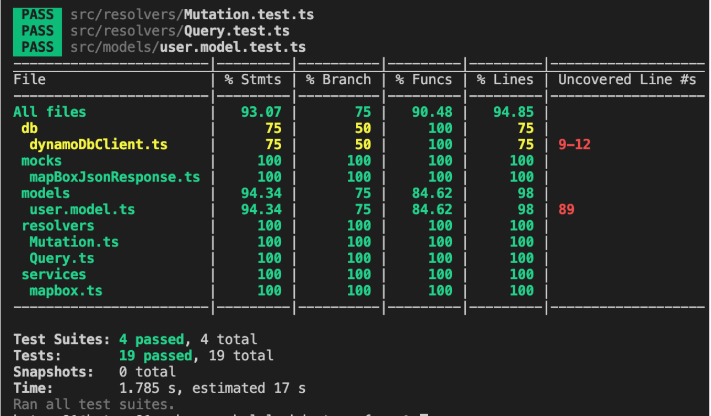

# graphql-lambda-terraform

This project expose a graphql api for CRUD operations on Users.

The graphql api is implemented using nodejs and graphql-yoga module. The persistance layer is implemented on AWS DynamoDB an connected to the nodejs app using the modele *@aws/dynamodb-data-mapper*.

For deployment testing, the graphql api was deployed as lambda function on AWS and exposed through AWS API-Gateway

# The overall architecture


# User model

The api offer operations over an user. The properties this user has are:
- id
- name
- dob (date of birth)
- address
- description
- imageUrl
- createAt
- updateAt

# Graphql operations
## Queries
- **findUser:** Find a user by Id
- **findUserByName:** Find a user by name
- **getUsers:** Get all user. This result set is paginated (by default by two items). Use *pageSize*(number) to set the number of items per page. Use lastEvaluatedId (userId) to indicate from where the query should return items.
- **getAddressCoordinates:** Gets the coordinates of the user address (use mapbox https://docs.mapbox.com/api/overview/)
## Mutations
- **createUser:** persist a new user
- **updateUser:** update an existing user
- **deleteUser:** delete an existing user

# Setup and deployment

## Enviroment variables

In order to connect to AWS dynamoDB, the project require the following enviroment variables which are setup in the terraform lambda file (*[PROJECT_DIRECTORY]/terraform/lambda_graphql.tf*)
- **ACCESS_KEY_ID:** your AWS account access key id.
- **SECRET_ACCESS_KEY:** your AWS account secret access key
- **NODE_ENV:** indicate the execution enviroment (for local testing, set it to development, anything else will be consider production)

For this project to run, you need to deployed into AWS cloud, for that you are going to need the following.
- AWS account
- AWS CLI
- Terraform

## Compress source code

Compress the *node_modules* and content of *dist/* folder and named as Archive.zip. Use the *scripts/compressFiles.sh* to generate the zip file
```
./compressFiles.sh
```

## Upload Compress file to S3

Upload the zip file to S3 bucket (s3://project-bucket.lambda. You can use what ever bucket you want, but you should update it on the terraform aws_lambda_function at set the *s3_bucket* with your custom bucket). Use the *scripts/uploadZipToS3.sh* to upload the zip file to s3.
```
./uploadZipToS3.sh
```

## Deploy

After setup AWS CLI and Terraform with your AWS credentials, run the following commands on your terminal in the *[PROJECT_DIRECTORY]/terraform* folder:

This initialize the terraform providers
```
Terraform init
```
Show you the plan that terraform is going to perform
```
Terraform plan -var="aws_access_key_id=[ACCESS_KEY_ID]" -var="aws_secret_access_key=[SECRET_ACCESS_KEY]"
```
Apply the plan, deploying the infrastracture
```
Terraform apply -var="aws_access_key_id=[ACCESS_KEY_ID]" -var="aws_secret_access_key=[SECRET_ACCESS_KEY]
```
Rollback the infrastructure deployed
Terraform destroy

### Deployment components

After deploying to AWS you will end with the following components:
- api-gateway
- lambda function
- dynamoDB

### Testing deployment

Open the AWS Managment console and go to api-gateway service. You should see ***graphql-user-api***. 


You can test the lambda graphql using the testing feature of AWS api gateway. Write the following Request Body

```
{"query":"mutation {\n  createUser(data: {name: \"lidsay\", dob:\"1988-07-07\", address: \"near galerias\", description:\"what a cute girl\", imageUrl: \"www.lindsay.instagram.com\"}){\n    id,\n    name,\n    description\n  } \n}"}
```
You should see the HTTP 200 status code


### Testing with Postman

The graphql api should be expose and can be called using the URL of the api gateway state *production*


# Local testing

you can test this app in you local machine using dynamoDB local and starting the graphql server.

## Local DynamoDB

You need Docker in  you machine to run dynamoDB
First create the dynamo container and execute it
```
docker run -p 8000:8000 amazon/dynamodb-local -jar DynamoDBLocal.jar -inMemory -sharedDb
```
For administrate you DB, you can use dynamodb-admin module
```
npm i -g dynamodb-admin
```
Finally to connect you DB manager run the following command on your terminal
```
DYNAMO_ENDPOINT=http://localhost:8000 dynamodb-admin
```
Open you browser at *localhost:8001*. Now create a table called *users* and add the following:
- As Hash Attribute Name (keyschema) use the name *id* with the type String.
- Select 3 for ReadCapacityUnits and 3 for WriteCapacityUnits
- Add a Secondary Index, call it *name_index* and as Hash Attribute Name use *name* with the type String.
- Select 3 for ReadCapacityUnits and 3 for WriteCapacityUnits
- Click *submit*


## Graphql Server

Run the following command from your terminal:

```
npm run build
npm run local
```
Open your browser at localhost:4000 


This playground will allow you to CRUD your local dynamoDB


# Code coverage



