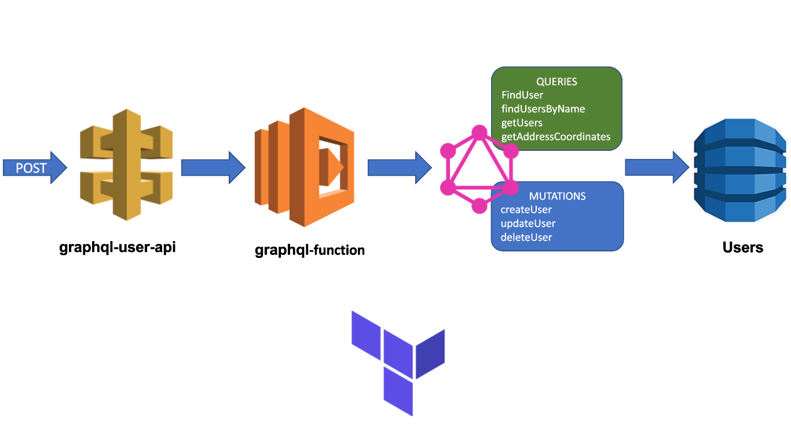

# graphql-lambda-terraform

This project expose a graphql api for CRUD operations on Users.

The graphql api is implemented using nodejs and graphql-yoga module. The persistance layer is implemented on AWS DynamoDB an connected to the nodejs app using the modele @aws/dynamodb-data-mapper.

For deployment testing, the graphql api was deployed as lambda function on AWS and exposed through AWS API-Gateway

# The overall architecture


# User model

The api offer operations over an user. The properties this user has are:
- id
- name
- dob (date of birth)
- description
- imageUrl
- createAt
- updateAt

# Setup and deployment

## Enviroment variables

In order to connect to AWS dynamoDB, the project require the following enviroment variables
- **ACCESS_KEY_ID:** your AWS account access key id.
- **SECRET_ACCESS_KEY:** your AWS account secret access key
- **NODE_ENV:** indicate the execution enviroment (for local testing, set it to development, anything else will be consider production)

For this project to run, you need to deployed into AWS cloud, for that you are going to need the following.
- AWS account
- AWS CLI
- Terraform

## Deploy

After setup AWS CLI and Terraform with your AWS credentials, run the following commands on your terminal in the [PROJECT_DIRECTORY]/terraform folder:

This initialize the terraform providers
```
Terraform init

```
Show you the plan that terraform is going to perform
```
Terraform plan
```
Apply the plan, deploying the infrastracture
```
Terraform apply
```
Rollback the infrastructure deployed
Terraform destroy

# Local testing

you can test this app in you local machine using dynamoDB local and starting the graphql server.

## Local DynamoDB

You need Docker in  you machine to run dynamoDB
First create the dynamo container and execute it
```
docker run -p 8000:8000 amazon/dynamodb-local -jar DynamoDBLocal.jar -inMemory -sharedDb
```
For administrate you DB, you can use dynamodb-admin module
```
npm i -g dynamodb-admin
```
Finally to connect you DB manager run the following command on your terminal
```
DYNAMO_ENDPOINT=http://localhost:8000 dynamodb-admin
```
